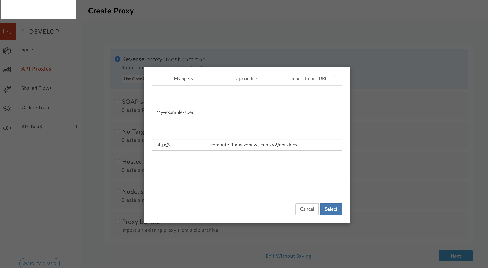
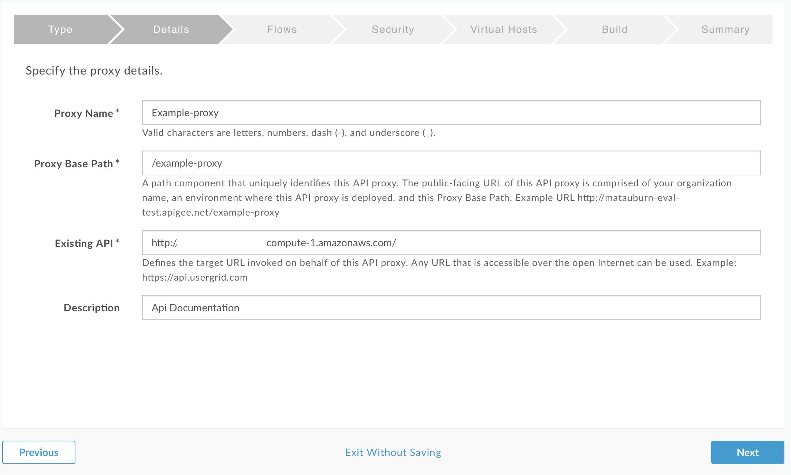
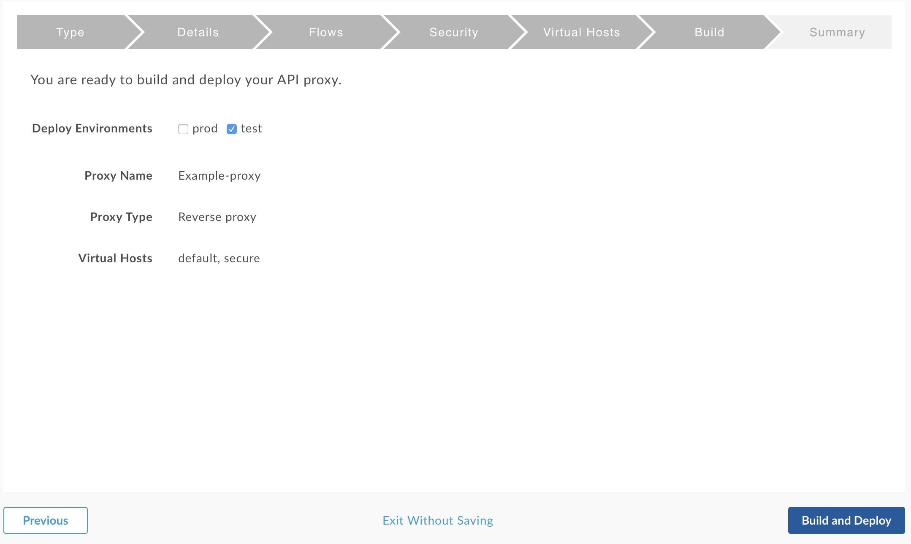
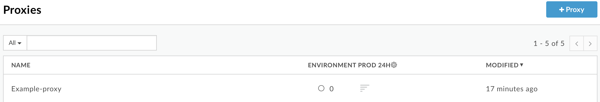
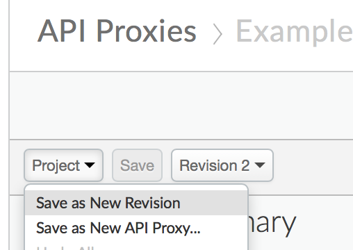
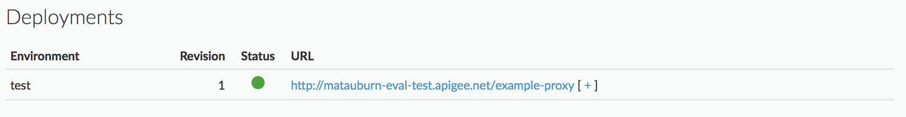
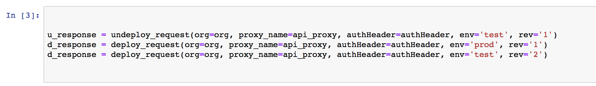
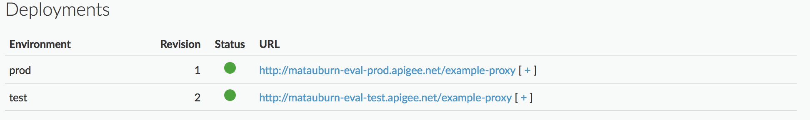

# Writeup using the apigee Management API to automate deployment tasks

## Intro
As part of any deployment strategy it is important remove as much human error as possible. An example of human deployment error can be seen here in this article about the rise and fall of Knight Capital. As described "In the week before go-live, a Knight engineer manually deployed the new RLP code in SMARS to its eight servers. However, the engineer made a mistake and did not copy the new code to one of the servers". The point of intrest is the mistake for not copying the code to all the processes.

These examples we can learn from and emphasies the reason why we need to automate a deploy strategy

## Setting up for a normal usecase
Once an evaluation account was created on apigee https://login.apigee.com/sign__up then it was possible to start using apigee and looking at some of the features we may want to use.

The primary usecase that we are intrested in is to create an apigee revese proxy and then when we make changes to how the revrse proxy works we want to be able to automate how we roll the changes out to production.

### Creating the revrse proxy

We are pointing the reverse proxy to an existing openAPI to pull in a spec and then follow the rest of the reverse proxy settings to create it. The following image shows the creation of our revese proxy

Then we set the name and the details of the proxy we want

Finally we build the proxy

We can now see this in the list of proxies

### Making a new reverse proxy revision

As we want to test the ability to script the rollout of a new revision we need to create multipe revisions that we can rollout. This can be done by making selecting to make a new revision:

## Automating the rollout of the proxy

### apigee managemnt API
apigee has a management API which is very well documented. This is avaliable here https://apidocs.apigee.com/management/apis
This is mangement API has a full range of functionality to create users, API Prouducts, API Proxies and a whole range of other features. The whole lifecycle of apigee can done through the managment API and the UI is not needed.

### Creating a script to rollout a new revision
Using python we are using a simple http client to connect to the apigee service to send the management requests. Specifically we are looking at the [deploy](https://apidocs.apigee.com/management/apis/post/organizations/%7Borg_name%7D/environments/%7Benv_name%7D/apis/%7Bapi_name%7D/revisions/%7Brevision_number%7D/deployments) and [undeploy](https://apidocs.apigee.com/management/apis/delete/organizations/%7Borg_name%7D/environments/%7Benv_name%7D/apis/%7Bapi_name%7D/revisions/%7Brevision_number%7D/deployments) functionality.

Initially we see that we have revision 1 for test running in the following image

We then launch our script which we show undeploys version one and pushes it to prod and then deploys version 2 to test

and here we see the result

### Summary
The code written to perform the automation is avaliable in the attached Jupyter notebook.
It is a simmple set of HTTP requests.

This information shos that it is possible to use the apigee Managment API cna be used as part of a release process to automate the deployment of apigee changes 